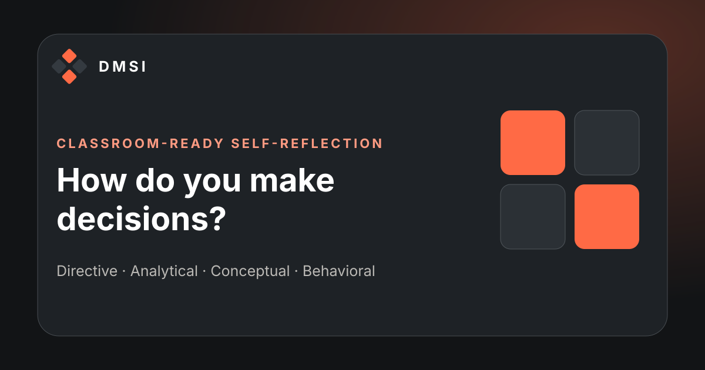

# Decision-Making Style Inventory

[Open the live assessment](https://mralexgarrido.github.io/dmsi/)



DMSI is a private, classroom-ready reflection tool for exploring four decision-making preferences: Directive, Analytical, Conceptual, and Behavioral. It is designed for students, creative teams, and facilitators who want a useful conversation about how people evaluate options and move work forward.

The application is intentionally dependency-free. It runs as a static site on GitHub Pages, stores responses only in the participant's browser, and does not transmit assessment data.

## What the experience includes

- A guided, one-question-at-a-time assessment that works well on phones and desktops
- Automatic forced ranking with the original 8, 4, 2, and 1 scoring pattern
- Clear progress, undo, back navigation, and local progress saving
- Light and dark themes with a remembered device preference and system-aware first visit
- A practical results dashboard with strengths, watch-outs, a stretch question, and a useful counterweight
- Two-style interpretation designed for creative-team discussion
- A full plain-text export containing the profile, scores, and all 20 ranked responses
- A classroom-ready print layout that can also be saved as PDF through the browser
- A copyable plain-text summary for learning reflections
- Keyboard navigation, visible focus states, semantic structure, live status updates, reduced-motion support, and print styling
- No analytics, advertising, accounts, cookies, external scripts, or data collection

## Scoring model

Each of the 20 prompts presents four responses. A participant ranks all four responses:

| Rank | Score |
|---|---:|
| Most like me | 8 |
| Second most like me | 4 |
| Third most like me | 2 |
| Least like me | 1 |

The four response positions map consistently to Directive, Analytical, Conceptual, and Behavioral. Each style can score from 20 to 160 points. The four style scores always total 300. The highest score is presented as the primary preference. Equal high scores are reported as a blended profile rather than resolved with an arbitrary tie-breaker.

## Project structure

| Path | Purpose |
|---|---|
| `index.html` | Semantic application shell and page metadata |
| `css/styles.css` | Responsive design system, components, accessibility states, and print layout |
| `js/questions.js` | Assessment prompts and interpretation content |
| `js/scoring.js` | Pure scoring and validation functions |
| `js/export.js` | Pure text-summary and full-report generation functions |
| `js/app.js` | Assessment state, rendering, navigation, persistence, and result actions |
| `js/theme-init.js` | Applies the saved or system theme before the interface renders |
| `tests/` | Automated checks for scoring, content contracts, privacy defaults, assets, and legacy-link continuity |
| `scripts/build.mjs` | Creates the static `dist/` deployment artifact |
| `scripts/serve.mjs` | Runs a dependency-free local development server |
| `dmsiform.html` | Preserves the original article link and forwards it to the new root experience |
| `.github/workflows/deploy-pages.yml` | Validates pull requests and deploys approved `main` changes to GitHub Pages |

## Run locally

Node.js 20 or newer is recommended.

```bash
npm run check
npm run dev
```

Then open `http://127.0.0.1:4173`.

To create the same artifact used for GitHub Pages:

```bash
npm run build
```

The build is written to `dist/` and is intentionally excluded from version control.

## Deployment

The GitHub Actions workflow follows a two-stage release path:

1. Pull requests run syntax checks and the scoring test suite.
2. A push to `main` validates the code, builds a minimal static artifact, and deploys that artifact to the protected `github-pages` environment.

Only the deployment job receives `pages: write` and `id-token: write`. Validation and build jobs retain read-only repository access.

## Accessibility and privacy

The interface uses buttons rather than drag-only ranking, so the complete assessment can be taken with a keyboard, touch screen, switch control, or screen reader. Status changes are announced through polite live regions. Content remains usable at narrow widths and with reduced motion enabled.

Responses are saved in `localStorage` under `dmsi-assessment-v2`, and the selected appearance is saved under `dmsi-theme`. Assessment data remains on the current device unless the participant explicitly copies, downloads, or prints the result. The plain-text export is assembled entirely in the browser and is not uploaded. Clearing site data or using the restart control removes the saved assessment.

## Classroom facilitation idea

Ask each student to record three observations after viewing the profile:

1. What does my leading style contribute when a creative team is under pressure?
2. What can my lowest-scoring style notice that I may overlook?
3. What decision stage should each style lead: exploration, evaluation, alignment, or commitment?

The most useful unit of analysis is often the team portfolio, not the individual label. A group with four strong scores in the same style may feel efficient while quietly sharing the same blind spot.

## Source and interpretation

The assessment framework and scoring pattern are attributed to:

Rowe, A. J., & Mason, R. O. (1987). *Managing with style: A guide to understanding, assessing, and improving decision making*. Jossey-Bass.

For applied context in marketing and creative work, read [Unlocking Creative Potential: The 4 Decision-Making Styles Every Marketing Team Needs](https://www.marketingsciencelab.org/p/improve-creative-team-performance-decision-making).

This project is an educational self-reflection experience. It is not a psychological diagnosis, a clinical instrument, or a validated basis for hiring, grading, promotion, or other high-stakes decisions.

## License and content notice

Original software code and interface assets in this repository are available under the [MIT License](LICENSE). The MIT License does not grant rights to third-party assessment wording, frameworks, publications, names, or other source material. See [NOTICE.md](NOTICE.md) for attribution and scope.
